# API Management - SAS Layer & REST connector

---

### SAS Layer
The ***SAS (Salesforce As Service) Layer*** is responsable for receiving the request and calling the 
***Service Layer***. Every single functionality from the server will be represented by a SAS class which will call
the method corresponding to that specific action.  

#### Example  

Let's take as an example the ***Authorization Management*** service used on the PostNL Business Portal:  
* `BPG_AuthorizationsManagementService` is responsable for basic actions on the ***Authorizations*** level, like 
  `executeMutations``addAccounts`, `removeAccounts`, `addUsers` etc.  
  
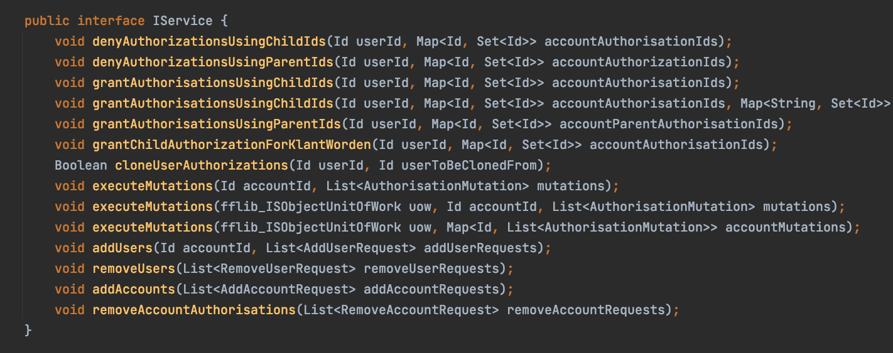  
  
* For every action mentioned above, there is a ***SAS Class*** defined: for example, `SAS_AuthorizationsAddAccounts`
  which receives the ***Request*** and calls the specific service method (in this case, `addAccounts`) method from 
  the main service class:  
  
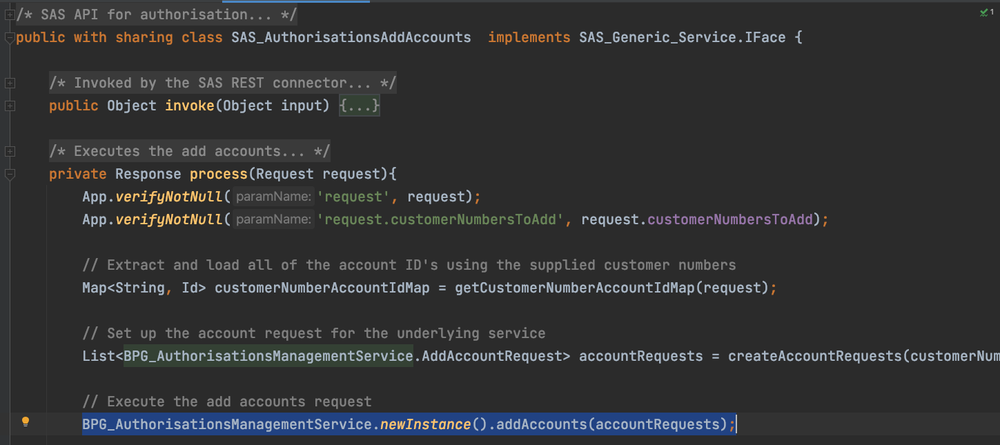  
  

### REST Connector  
A REST connector API is an intermediary API for calling REST endpoints in enterprise systems or third-part APIs.  
The connector communicates and passes information between the client and the server using the HTTPS protocol.  
The purpose of this connector is two-fold:  
* To provide a generic means of parsing input parameters, calling the underlying C-type service,
             returning output and handling errors - this is accomplished by providing a single method (`doGet` or `doPost`)
             in which the JSON deserialization of input, calling of the service, deserialization of the output to JSON
             and handling of error responses is handled.  
* To handle different versions of the same service without needing to have different REST Connector versions.
             This is done by taking the incoming URI and retrieving the relevant input, service and output classes
             from the `SAS_Connector_Setting__mdt` custom metadata type.  
  
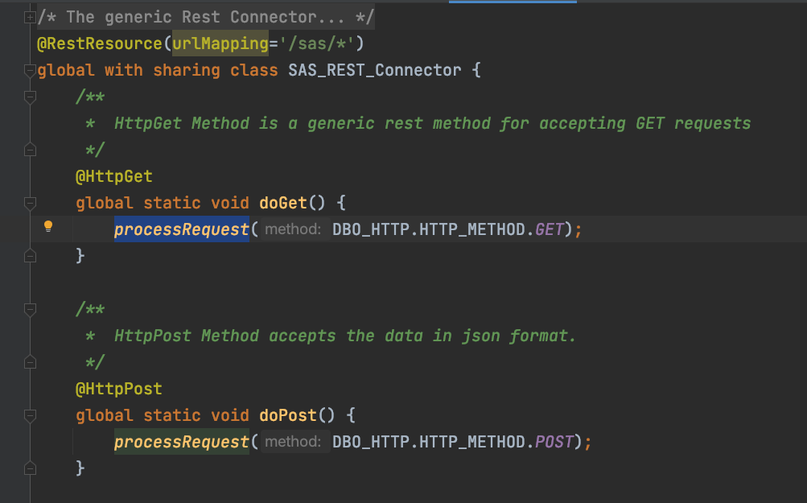  
  
The same `process` method is called, with different ***HTTP method parameters*** with respect to the type of the request.  
  
### New API Structure
In the new API Model used on PostNL, the layers which now are responsable of interacting with the ***Service Layer***
are called ***Experience***, ***Process*** and ***Core***.
  
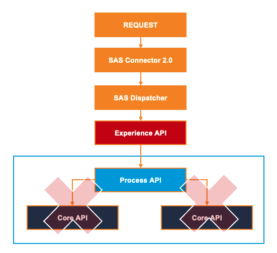  
  
* `SAS Connector 2.0` is responsable for taking the request, finding the service that matches the URL and passing it to the Dispatcher.
* `SAS Dispatcher` is responsable for translating the received request into the relevant HTTP method.  
* `Experience API` is the 'closest' to the user and is responsable to translate the request into a process / core request.  
* `Process API` is mostly necessary when more cores are involved in the same functionality and calls them.  
* `Core API` is responsable for calling the service and providing the actual functionality.  
! Every call from experience to process / core will be done through `SAS Dispatcher`. The Core will only 
  tanslate the request from experience to process / core and then call the Dispatcher with the new request.  

This is an example of Experience API for User Preferences section of the Business Portal. It translates the
experience request into a core one and calls the Dispatcher.

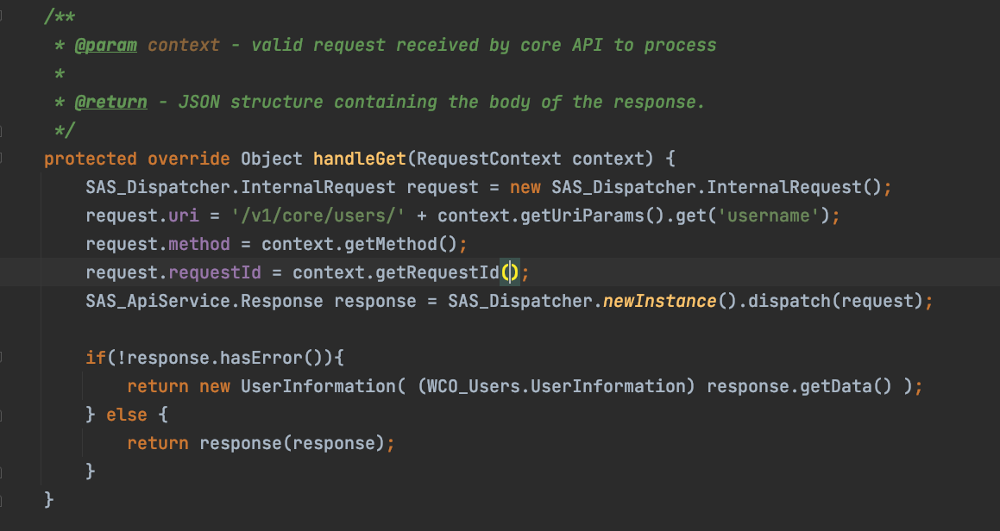  
  
Then the Core layer will translate the request into the structure defined in the ***Service Layer*** and then call it.  

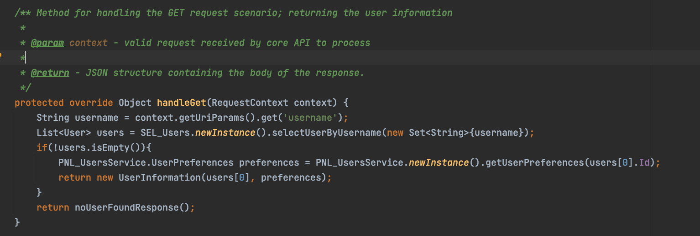  
  
#### Naming Conventions  
The existing naming conventions have the same prefixes (ex: SAS_CommunityUser) and it makes them difficult to differentiate one from another.
Also, the naming does not specify the type of the API (whether it’s Experience, Process or Core), hence it’s difficult to decide the layer on which the API is situated.
New naming conventions are needed, such that the scope and the type of the APIs are highlighted.
Naming conventions contain a prefix which indicates the type of API, followed by the name of that specific API. The name of the API must be plural.  

• WEX_Name – Web Service Experience API  
• WPR_Name - Web Service Process API  
• WCO_Name – Web Service Core API  
  
#### Request Types  
We are using 5 types of requests, corresponding to every ***HTTP Method***:  
• `GET` Used for retrieving and requesting data from the created resource. ONLY used for receiving data, not changing 
the state of the server. The request is defined in the endpoint, where it contains all the information that needs to be
retrieved.  
• `POST` Used for sending data to the server in order to create or update a new resource. The data which needs to be sent 
to the server is stored in the request body of the HTTP request.  
• `PATCH` Used for performing partial modification to an already existing resource. The set of instructions necessary for 
updating the resource is given through the request body of the HTTP request.  
• `PUT` Used for replacing all current representations of the target request resource with the one mentioned in the method. 
The information is specified in the request body.  
• `DELETE` Used for deleting a request resource. It sends a request responsible for deleting the request resource of the 
specific URL. May or may not contain a request body.  

#### Endpoints Naming Conventions  
For every type of API we use the following 
- Experience API  
    - Endpoint format:  
    - GET: / services / apexrest / {{ version }} / experience / {{ channel }} / {{ name }}  
    - POST: / services / apexrest / {{ version }} / experience / {{ channel }} / {{ name }  
      
- Process API  
    - Endpoint format:  
    - GET: / services / apexrest / {{ version }} / process / {{ name }}  
    - POST: / services / apexrest/ {{ version }} / process / {{ name }}  
      
- Core API  
    - Endpoint format:  
    - GET: / services / apexrest / {{ version }} / core / {{ name }}  
    - POST: / services / apexrest / {{ version }} / core / {{ name }}  
#### Examples  
Let's take an example of an experience API (`WEX_Users`) and see the request structure:  
  
`GET`: It will only be composed of an endpoint; in this case the give **URI** parameter is the **username**  

  
  
The response will contain the User information:  

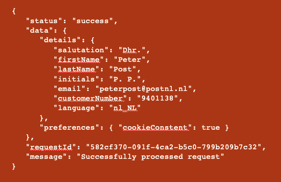  

`PATCH`: It will be composed of an endpoint and the request body where there will be specified which properties we want 
to update:  

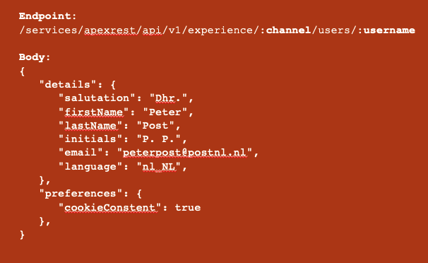  
  
The returned JSON will contain information about the status of the response. In the case where the request is successfully 
processed the following response will be returned:  

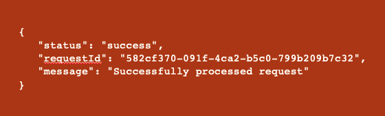  
  
#### Response Structure
1. `Success Scenario`:  

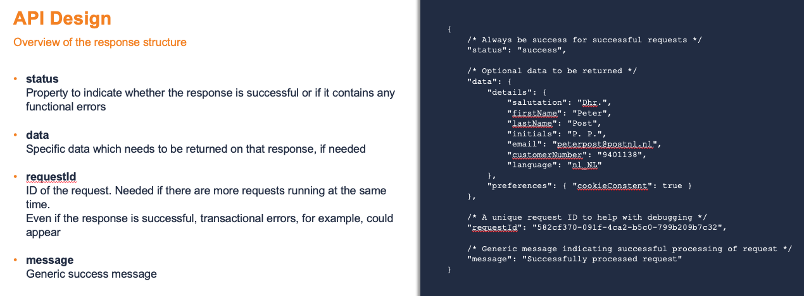  
  
2. `Error Scenario`:  

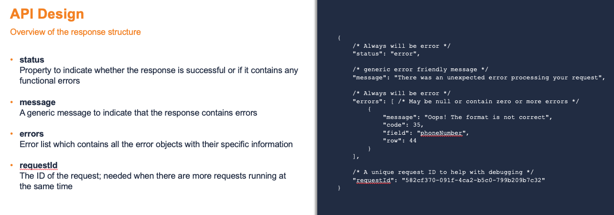  

---

[Home](/wiki/Home.md) - [Backend](/wiki/backend/backend.md) - API Management - SAS Layer & REST connector
