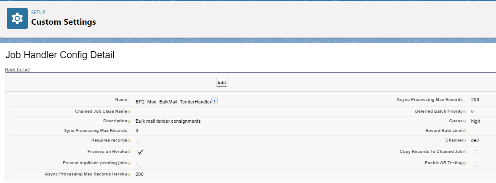

# Job items framework(sync/async job execution on the platform or on Heroku)

---

#### What is Job items framework?
The Job Items Framework is responsible for enqueuing job items into a queue and either executing it synchronously or
asynchronously. It is a tool to aid with handling complex jobs which cannot execute within a single transaction.
These jobs may be executed either on the platform or on Heroku.

#### What is a Job item ?
A job item represents a single request to offload work to a job item handler.
The status of a job item maybe in progress, failed or success. A job item maybe retried.

#### In which class should our custom processing logic be placed ?
The code that must be executed to process the job item is located in a handler class that extends class DBO_JobItemHandler.

#### Setting up a job item - example code
DBO_JobItem item = new DBO_JobItem('MyJobItemHandler');
item.addRecordId('00100000CB45pAs');

Passing a list of parameters:
DBO_JobItem item = new DBO_JobItem('MyJobItemHandler', parameterList);

#### Setting up a job and enqueue it - example code
DBO_JobService.newInstance().enqueueItem(item);

#### Queueing, priority and batch processing
The job framework depends on scheduled APEX to run at set intervals to restart the batch processor. 
Several instances of this class should be setup throughout the day to ensure job items in the queue are processed as quickly as
 possible

#### Scheduling the job
There is a custom setting called 'Job Handler Config' (DBO_JobHandlerConfig__c),
which holds the details of the job to be scheduled.
Some fields on the custom settings : queue (low, medium, high), process on heroku, sync/async processing max records...

An entry must be made in this custom setting for each job handler that must be executed.

#### Status of a job item
UNKNOWN  - unable to determine the status set from the job item handler, one may not have been set.</li>
PENDING  - item has not yet been picked up by the future callout or batch job and is available for 
                  processing.
SUCCESS  - item was successfully processed and no errors were encountered.</li>
FAILED	 - item was not correctly processed either due to an internal system error or the job item
                   handler setting the value specifically due to business logic.</li>
ABORTED  - item was marked as aborted due to reaching a rate limit.

#### Chained Job execution
When a job item handler completes executing it will check if any other job item is still pending and if there isn't, 
it will execute any chained jobs

---

[Home](/wiki/Home.md) - [Backend](/wiki/backend/backend.md) - Job items framework(sync/async job execution on the 
platform or on Heroku)
