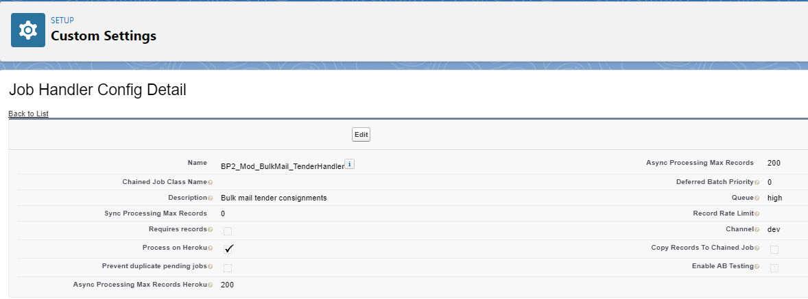

# PostNL Business Engine

---

#### What is PostNL Business Engine?
This is a heroku app to process some of the crucial business operations which are plagued by performance issues on Salesforce platform.
The app can also be extended to several other requirements in case needed.
eg : Basket Sync, Import Shipments etc.

#### When should you move to Business Engine ?
If you are considering implmenting a job handler within the PostNL Business Engine then please ensure you read the following questions and answers to gain a better understanding of where you should be developing and potential pitfalls to avoid.

* Do you require an integration with an external system?

    Integrating with external systems will require additional time and orchestration.
    
    -Reasons to select:
    
            Direct connectivity to the external systems from the PostNL Business Engine will simplify the routing of callouts from the platform when they are direct.

             Your job handler or process requires an integration.
    -Reasons to consider:
    
            External systems must be visible to the application when it runs on Heroku, but also when the application being developed on developers machines locally.
            
            Integrations must utilise API Management.

 * Will you require Heroku Connect within your solution?
 
    Heroku Connect is an add-on which enables near real-time synchronisation of data between a Postgres database available on the Heroku platform and data which resides on the Salesforce platform, and vice-versa.
    
    -Reasons to select:
    
            Using Heroku Connect will greatly simplify working with data stored within Salesforce.
            
            Manipulation of data is significantly easier due to only having to worry about writing to database instead of working with API's.
            
    -Reasons to consider:
    
            The contract which PostNL has with Heroku dictates how many total rows can be synchronised between the two systems. Consider how much data you need to synchronise in total and check if there is sufficient capacity available.
            
            Updates are synchronised between the two systems in near real-time, although there can be delays.
            
            Error handling must be considered for rows which cannot be synchronised. A constraint in Salesforce may cause an integration issue for example.

 * Is the job mission critical?
 
     If the job being considered is mission critical to the business then it may be a strong indication to develop it on within the PostNL Business Engine.
   
    -Reasons to select:
    
            During peak periods the Salesforce platform may become saturated with background activities and all users may have to wait until resources become available.
            
            The PostNL Business Engine can scale horizontally during those periods to provide additional capacity.
            
    -Reasons to consider:
    
            If the job is not mission critical or time dependent then it may be cheaper and more cost efficient to implement the logic on the Salesforce platform.
            
            Jobs can execute sometimes quicker on the Salesforce platform due to the no need to export and process jobs; they are executed on the same platform as the data resides.

 * Is the process used by customers?
 
     Customer facing processes are anything where the end user can see the application directly through an exposed endpoint, or a job handler which the end user directly initiaties.
   
    -Reasons to select:
    
            The PostNL Business Engine can scale horizontally based on demand and as such can cope with additional unexpected load or provide additional capacity during peak periods.
            
            Some processes may not be able to run natively on the Salesforce platform due to the governor limits which are imposed. Moving to the PostNL Business Engine may be suitable option in these situations.
            
    -Reasons to consider:
    
            Security, the PostNL Business Engine does not yet have access to the built in security controls which reside on the Salesforce platform such as permissions, roles, org-wide security, or the sharing model. You may have to consider this when implementing functionality.

 * What is the utlilization of the job / how much processing power does it require?
 
     On the Salesforce platform we have a fixed amount of resources which is shared across the whole application. The PostNL Business Engine does not have this limitation, however capacity management is vital for ensuring the platform is responsive at all times.
   
    -Reasons to consider: 
    
            How many jobs are expected to be executed on a typical day and during peak times? This is to consider what demand will be placed on the system to ensure sufficient processing capacity is available. This is for horizontal scaling.
            
            Will your job or process require significant amount of CPU or memory? Dedicated resources can be provided to handle processing of jobs on the platform, however dedicated processor types may have to be provisioned

#### How does it work ?

The application depends on two connected Apps
    -PostNL Engine Localhost
    -PostNL Engine Heroku
Both apps are configured in the same for all settings, except the callback URL's. To support local development a separate app is required to redirect users back to localhost instead of back to Heroku.
The Business Engine works in tandem with the job framework [Job items framework(sync/async job execution on the platform or on Heroku)](/wiki/backend/jobitemsframework.md)

The Process on Heroku checkbox on Job Handler Config needs to be checked. Refer: ()
Once the Job Item is enqueued and is eligible to be processed on Heroku a platform event (DBO_JobItemEvent__e) is dispatched from DBO_Job.cls and Heroku app will
subscribe to this event and will be picked up by Bull queue implemented on Heroku and the processing will start. Once the processing is done Heroku then will send the
processed records to Salesforce via REST Api calls , details can be found out in App_GenericRest.cls

#### What will you need on Heroku for processing ?
As to process something on SF you need a piece of code, similarly to process something on Heroku you will need to write some code. As Heroku pipeline has an integration with GitHub
we maintain a separate repository on it, for which access can be granted on a need to need basis.
A new module has to be defined in https://github.com/deloitte-nl/postnl-business-engine/tree/master/apps/processor/src/modules
Please note that we use NodeJS as our development language for Heroku as Apex is not a supported language.

#### Things to install before you start
The following tools must be installed on your local machine before getting started

    -VS Code - recommended IDE for development. Code standards will be automatically enforced if you use this editor.
    
    -NodeJS - this is required to run the application, but also for the NPM (Node Package Manager).
    
    -Docker - used for running Postgres and Redis. This also includes Docker Compose (more on this later).
    
    -TypeOrm - npm install -g typeorm.
    
Along with the above you will need to get access to the git repository.

        For this please contact Jasper Stoop (JaStoop@deloitte.nl) and to access the postnl-business-engine contact Adam Marchbanks (AMarchbanks@deloitte.nl) or Sejal Gada (SGada@deloitte.nl)
        
You will also need to sign up for the Heroku and to access the Heroku app please contact Adam Marchbanks (AMarchbanks@deloitte.nl) or Sejal Gada (SGada@deloitte.nl) or Mayank Saxena (masaxena@deloitte.nl)

----

[Home](/wiki/Home.md) - [Backend](/wiki/backend/postnlbusinessengine.md) - PostNL Business Engine

