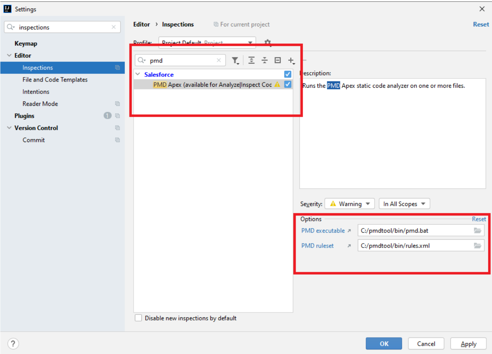
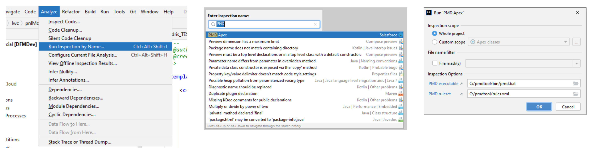
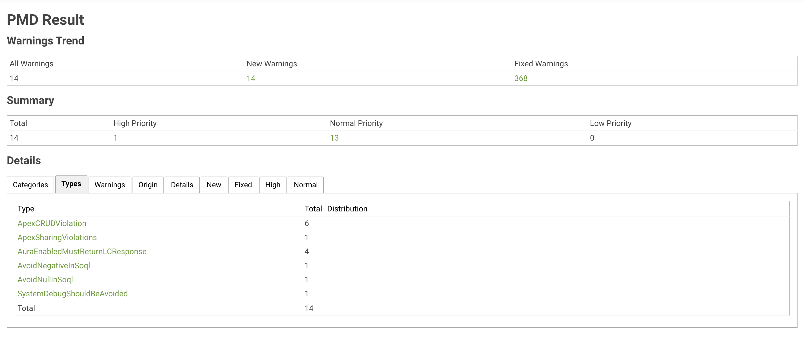

# Apex PMD

---
PMD is a source code analyzer. It finds common programming flaws like unused variables, empty catch blocks, unnecessary 
object creation, and so forth. It supports Java, JavaScript, Salesforce.com Apex and Visualforce, PLSQL, Apache Velocity, XML, XSL.

Additionally it can also includes CPD, the copy-paste-detector.

### How to get started?
1. Get the PMD binary executable from official website: https://github.com/pmd/pmd/releases
2. There are 3 items in the folder:
    - bin: the binary executable files
    - lib: the java libraries which contain rules 
    - LICENSE 
3. It can be used in both command line interface or integrated in Intellij
4. Create a ruleset file, for example, “rules.xml” in the bin folder
5. Open IntelliJ, go to the “Preferences” dialog and find the “Inspections” subtab
6. Search for “pmd”, and select the “PMD Apex”
7. At the right side of the screen, fill in the 2 options
    1. PMD executable: the path to the pmd.bat file 
    2. PMD ruleset: the path to the ruleset file
    
    
  

### How to run PMD? 

1. Go to the menu “Analyze” and select the option “Run Inspection by Name...”
2. Search for PMD, and select “PMD Apex”
3. In the dialog, we can select to check for the whole project or customize the scope to check. 
The options part at the bottom has been configured already in the initial setup

  

### View PMD results from build check
1. On a PR, on the right-hand side click on the Jenkins green build
2. On the left-hand side, click on the menu "PMD Warnings"

Note: If no warnings identified in the destination branch, the menu item mentioned above is not visible. The message below
will be at the bottom of the page

  

3. A report will be displayed, containing a summary of the threats' priorities, types, categories, as well as an overview
of the class and the line number where that code smell was detected

 

### Rule categories:
- `Best practices`: Rules which enforce generally accepted best practices ( ex. Assertion should include messages )
- `Code style`: Rules which enforce a specific coding style ( ex. If statements with brackets )
- `Design & Documentation`: Rules that help you discover design issues ( ex. Avoid deeply nested logic )
- `Error Prone & Security`: Rules to detect constructs that are either broken, extremely confusing or prone to runtime errors, 
and flag potential security flaws ( ex. Avoid hardcoded ids )
- `Performance`: Rules that flag suboptimal code ( ex. DML/SOQL in a loop)
- `FFLIB specials`: Rules that checks code according to FFLIB structures ( ex. Constructor in DOM layer )

### Process for violations based on priority

`1 - CRITICAL`
- The build check should fail 
- The violation(s) should be fixed immediately
- The dev team should be informed asap

`2 - HIGH`
- The violation(s) should be fixed in the next sprint
- The build check should fail when the number of violations reaches a threshold (agreed by the project team)
- Ops user story should be created with high priority

`3 - MEDIUM`
- The violation(s) should be fixed depending on capacity
- The build check should fail when the number of violations reaches a threshold (agreed by the project team)
- Ops user story should be created and picked up by dev teams

`4 - LOW`
- The violation(s) should not block the build check and go-live process
- Ops user story should be created with low priority, and picked up based on capacity

`5 - INFO`
- It is only for information
- The rules are optional for code quality check

---

[Home](/wiki/Home.md) - [Coding best practices](/wiki/coding_best_practices/coding_best_practices.md) - Apex PMD
