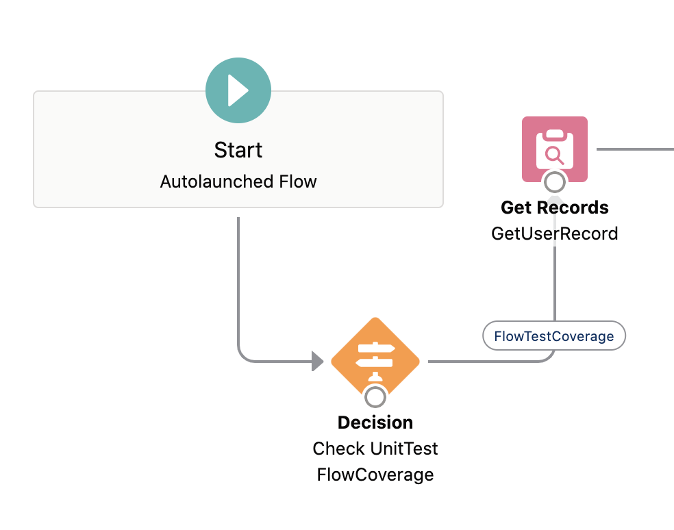

# Flow test coverage

---
To deploy a process or flow as active, the flow test coverage should be **at least 75%**. To calculate the flow test coverage, Salesforce divides the number of covered flows and processes by the sum of the number of active processes and active autolaunched flows.  

There are two Tooling API objects that you can query to calculate test coverage for processes and autolaunched flows.  
1. **[FlowTestCoverage](https://developer.salesforce.com/docs/atlas.en-us.api_tooling.meta/api_tooling/tooling_api_objects_flowtestcoverage.htm)** represents test coverage for a flow by an Apex test method. 
2. **[FlowElementTestCoverage](https://developer.salesforce.com/docs/atlas.en-us.api_tooling.meta/api_tooling/tooling_api_objects_flowelementtestcoverage.htm)** records are created when an Apex test method executes a flow element.

The following error is shown if there is not enough flow test coverage:  
`Test coverage of active processes and autolaunched flows is 74%, but at least 75% is required.`

### How to add flow test coverage?


1. Identify the autolaunched flows (no trigger) which are not covered in the unit tests.
2. Create a variable in the flow, which should be a part of the FlowTestCoverage of the type boolean and add it to the desired flow. The variable should be called `varTestCoverage`.

3. Add the flow name in the following class: `UT_FlowTestProvider`

```
   @IsTest 
   static void set4() {
      mockTest(new List<String> {
          'Flow_DeveloperName',
          'AnotherFlow_DeveloperName'
      }; 
   }
```

>Note: Make sure to keep the number of flows in one test method no bigger than 6.
   

---

[Home](/wiki/Home.md) - [Coding best practices](/wiki/coding_best_practices/coding_best_practices.md) - Flow test coverage
