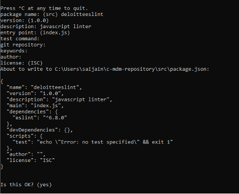
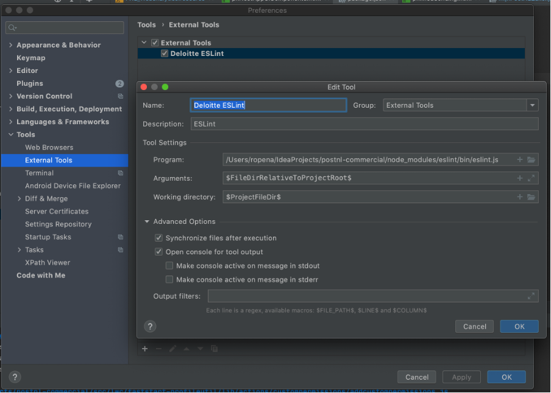
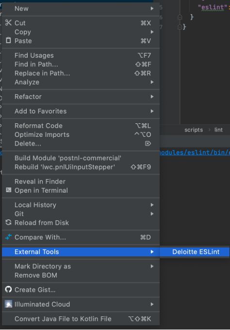
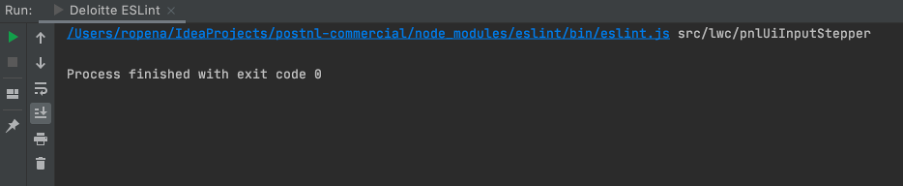

# Linting - LWC

---

### What is ESLint?
ESLint is a powerful linting utility for JavaScript and is highly configurable and extendable.
Linting is the process of running a program that will analyze code for potential errors.

### Steps to install ESLint

1.	Download and install node.js (version  12.16.3 ) by clicking [here](https://nodejs.org/en/download/)
2.	Go to command Prompt and run the below commands:

        - In cmd, navigate to your local repository root folder. Execute following command to verify cache:
            - npm cache verify
            - npm init
        - Fill in below information:
        - Package Name: *any name in small letters*
        - Description: *any description*
        - Press enter until it asks: Is this OK?
        - Enter: Yes

        

        This will create package.json file in local repository folder.
        - npm install eslint @salesforce/eslint-config-lwc @salesforce/eslint-plugin-aura --save-dev

        After running the above command new entries will be created for both LWC and AURA in the 'devDependencies' sections in the package.json file.
   
3. Manually replace the below script in package.json file

    ```
    "scripts": {
        "lint"       : "npm run lint:lwc && npm run lint:aura",
        "lint:lwc"   : "eslint  **/lwc/**/*.js",
        "lint:aura"  : "eslint  **/aura/**/*.js"
    },
    ```

4. Check if .eslintrc files are present in LWC and AURA folder

5. In cmd, navigate to the src folder of a project(example: localRepo/src/) and you are good to go for EsLinting.

To lint LWC run following command:  npm run lint:lwc --silent
To lint aura run following command: npm run lint:aura --silent

### Configure the external tool to run the ESLint on a file or folder in Intellij

1.	Open Settings (Preferences for macOS users) and search for External Tools.
2.	Create new and configure as below

 

3.	Save and apply

### How to use ESLint:

1.	Click on a file/folder
2.	Click on External Tools
3.	Select Deloitte ESLint



4.	If the folder/file doesn’t contain any error, this message will be printed:



5.	If there are errors in the folder/files, you will see different errors printed followed by the name of the rule


---

[Home](/wiki/Home.md) - [Coding best practices](/wiki/coding_best_practices/coding_best_practices.md) - Linting - LWC
