# Unit testing - best practices, mocking, proper asserting, usage of Test Factory

---

### Apex Testing Framework
To facilitate the development of robust, error-free code, Apex supports the creation and execution
of unit tests.  
The Apex testing framework enables you to write and execute tests for your Apex classes
and triggers on the Lightning Platform.  
Apex unit tests ensure high quality for your Apex code and
let you meet requirements for deploying Apex. They can be defined in the following way:

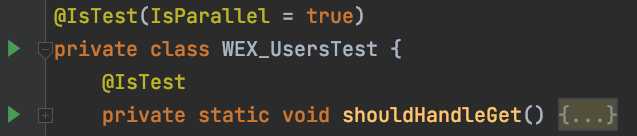  

### Naming Conventions
The naming convention for any test class is `<ClassName>Test`. In the above case: `WEX_UsersTest`.  
For test methods, the naming convention is `should<MethodName>` for positive scenarios and
`shouldThrowErrorFor<NegativeScenarioName>`.  
Both test and method classes must come with `@IsTest`
annotation.  

### General Testing Considerations
1. Test methods type is ***void*** and the default access modifier is ***private***.
2. For testing private / protected methods, use `@TestVisible` annotation on the tested method.
3. Always set `IsParallel` to ***true*** unless some test method is run as a different user
   using the `runAs` method.
4. Test coverage for deployment imposed by Salesforce is 75%.
5. Test coverage for deployment suggested by Deloitte is 85%.
6. Every Apex Class or Trigger must come with unit tests.
7. When deploying Apex to a production organization, each unit test in your organization
   namespace is executed by default.
8. While only 75% of your Apex code must be covered by tests, don’t focus on the percentage
   of code that is covered. Instead, make sure that every use case of your application is
   covered, including positive and negative cases, as well as bulk and single records.
   This approach ensures that 75% or more of your code is covered by unit tests.
9. Complete successfully without throwing any exceptions, unless those errors are expected
   and caught in a try...catch block.
10. Create the necessary data in test classes, so the tests do not have to rely on data in a
    particular organization.
11. Test the classes in your application individually. Never test your entire application in
    a single test.
12. Split the most important steps of the testing process through comments:  
    `// Create Mocks` - Preparing the mocking data (Optional step);  
    `// Given` - Preparing the data;  
    `// When` - Calling the method with the prepaared data;  
    `// Then` - Checking the results with assert methods;  

### Proper Asserting
The asserting part is the one that deals with checking if the provided results of a method
are the expected ones.  
This can be performed most of the time by using the following methods: 
`System.assert()` or `System.assertEquals()`.  
`System.assert()` checks if a statement is true,
while `System.assertEquals()` checks if an expected value is equal to the actual one.  

### Asserts Considerations
1. Asserts do not affect the code coverage, but they play an important role in checking your data and it's 
recommended to have as many asserts as possible per method.
2. Calls to `System.debug` are not counted as part of Apex code coverage.
3. Asserts can also be written in try... catch blocks for checking a certain error scenario, if that
parcitular exception is supposed to be thrown.
4. If a certain method returns a response with several parameters, first perform a check on the whole 
   response (not to be null), then check every parameter one by one.  
5. If the tested method is ***void*** and you have mocked methods in your test, use the `verify()` method instead.
It checks how many times the specified method from your mocked class was called.  

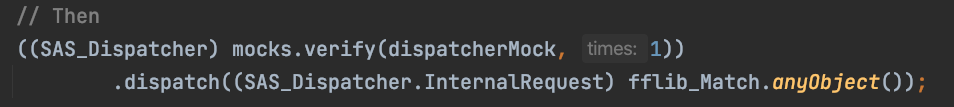
   
### Example:  
Let's take a unit test example of a selector class method:
This is the method which should be tested:
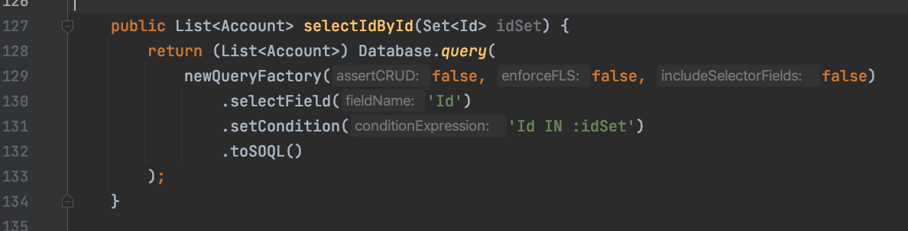  
This is the actual test method:  
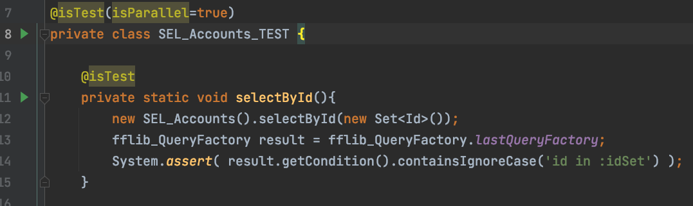  

### Mocking
Mocking a class means that you programmatically establish how is going to react, what is going to do and return.  
As an example, think on a ***Case*** record that needs an ***Account*** because the code that we want to test does validate against 
the related Account record.  
***ApexMocks*** is the framework used by Salesforce for mocking and it contains two different types of replacement objects:  

1. **Mocks**: Mocks simply reply with pre-defined data. Mock objects work on the object level.  
2. **Stubs**: A stub returns pre-defined data based on input from the test. Stubs replace individual methods.  

### Examples:  
  
#### Mocking a selector  
  
Setting up the mocking data for the specific selector:  

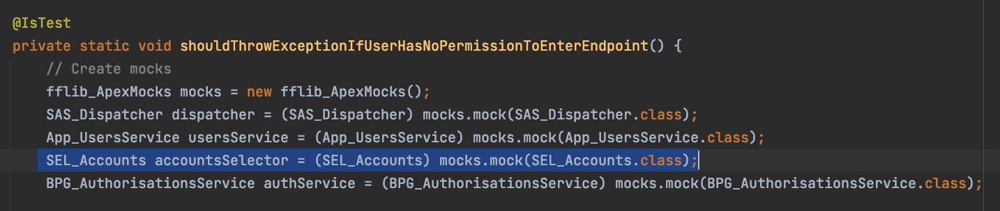  

In the stubbing part it can be observed that we actually "ask" the `selectByCustomerNumber` method to return a list of
accounts when it's called with a certain ***customerNumber***:  

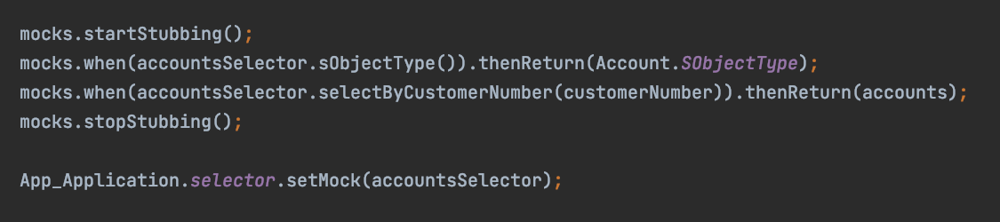  
  
#### Mocking a Service  
  
Setting up the mocking data for the specific service class:  
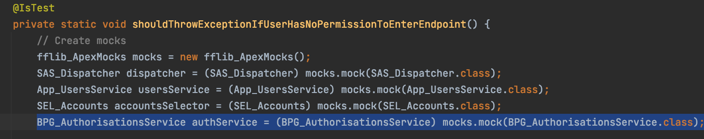  
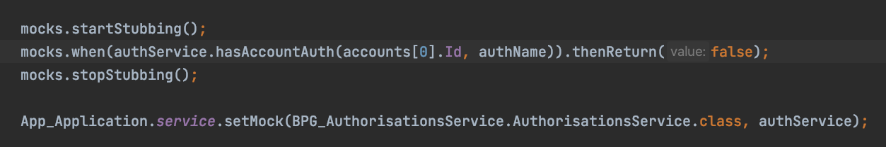  
  
#### Mocking a Unit of Work  

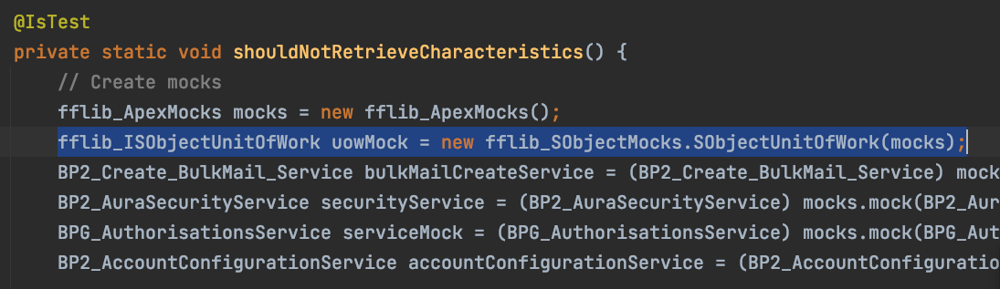  
Observe that in the stubbing part, there is not ***uow*** method to be mocked.  
That is because the unit of work methods like `commitWork()` or `registerNew()` return void type.  
Therefore we don't have any data to return and no methods to stub.  
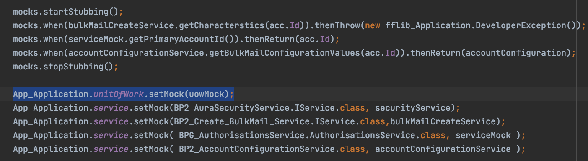  
  
!! For complex type input parameters the `fflib_Match` class and `anyObject()` method can be used:  
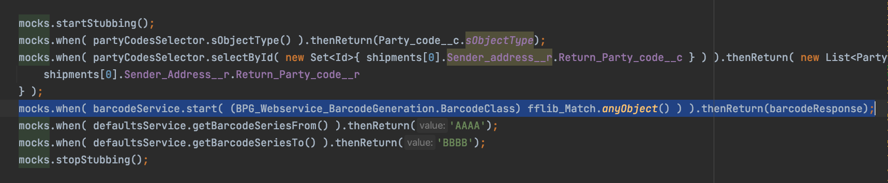

### Mocking Considerations
1. We only mock classes from ***Selector*** and ***Service*** layers. Also ***UnitOfWork***.
2. Always try to use actual data, set in the test method instead of `fflib_Match.anyObject()`. This must be used only in special cases. 
3. Always check the code coverage. Even though the test passes, there might be classes which need to be mocked and which only have impact on the coverage aspect.  

### Usage of Test Factory Classes
The TestDataFactory class is a public class that is annotated with `@IsTest` and can be accessed only from a running test.  
Test utility classes contain methods that can be called by test methods to perform useful tasks, such as setting up test data.  
  
### Example:  
In PostNL Project we use `UT_TestFactory` and `UT_TestFactoryBuilders` classes.  
`UT_TestFactoryBuilders` contains some inner builder classes corresponding to each Salesforce object.  
These classes might contain special methods which assign values to their specific fields.  
This example presents a builder class for the Address__c custom object with some methods responsable for setting the 
`Type__c` field of this object.  

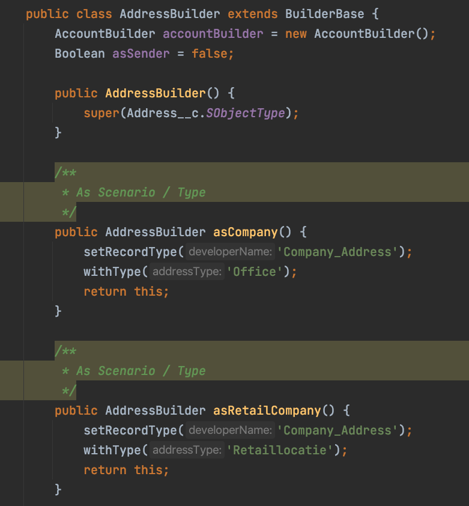  

`UT_TestFactory` contains methods that call the builder classes from the `UT_TestFactoryBuilders` class.  

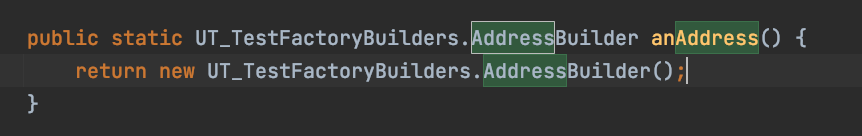  
  
In the Account Selector mocking example before, in order to create an Account list to be return in the stubbing 
part, we actually used a test factory class to build the actual Account.  

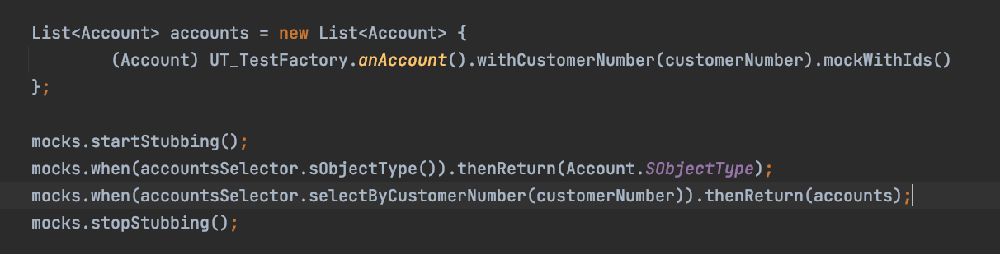  
  

### Test Factory Considerations
1. Never use direct object instantiations in unit tests. Always use Factory classes.
2. If your Salesforce object does not have a factory builder, create one, rather than directly instantiating the object.

---

[Home](/wiki/Home.md) - [Coding best practices](/wiki/coding_best_practices/coding_best_practices.md) - Unit testing - best practices, mocking, proper asserting, usage of Test Factory
