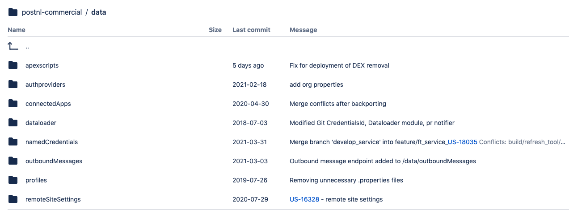

# Modules for automation

---
For better handling of outbound message endpoints, connected apps, auth providers, named credentials, the deployment process includes these modules, the information related to them being recorded in the targeted files.  

The data folder structure where the configuration files are present is the one below, the folders of each module can be recognized, each of them containing properties files as per the type of the environment. 

For instance, the file dev.properties store the endpoints belonging to the dev environment:

The build folder structure where the same changes have to be made in order to complete the configuration of the modules is the one below. The process is the same as for the one described above.

We will further go through each module and explain a little bit the process. 

## Connected apps

Connected apps are used for establishing the connection with 3rd party systems, e.g., the set-up of the pipelines in Jenkins. For each connected app present in the environment, the related information have to be added in the .properties files from the repository they differentiate each other for each environment in which they are configured depending on their type (dev/test/UAT/Production).

The files that must be updated can be found at 

* **postnl-commercial/data/connectedApps** 
	- dev.properties 
	- prod.properties 
	- test.properties 
	- uat.properties 

* **postnl-commercial/build/deploy/modules/connected_apps/orgs** 
	- dev.properties 
	- prod.properties 
	- test.properties 
	- uat.properties 

## Outbound messages

Outbound messages are used for sending messages to external web services or applications when records are created/updates. Like connected apps, the information must be added as per the environment type (dev/test/UAT/Production).

The files that must be updated can be found at

* **postnl-commercial/data/outboundMessages**
	- dev.properties 
	- prod.properties 
	- test.properties 
	- uat.properties 

* **postnl-commercial/build/deploy/modules/outbound_message_endpoints/orgs**
	- dev.properties 
	- prod.properties 
	- test.properties 
	- uat.properties 

The configuration file is defined as such: 

**[Object name].[outbound message name] = [endpoint]** 

If an outbound message endpoint cannot be replaced due to missing configuration, the build will fail. 

## Remote Site Settings

Remote Site Settings are used when you want to access external sites in the Salesforce application using callouts, webservices etc to avoid accessing malicious websites from Salesforce.com.

In repository, the files related to the specific environment types must be updated and can be found at:

* **postnl-commercial/data/remoteSiteSettings** 
	- dev.properties 
	- prod.properties 
	- test.properties 
	- uat.properties

* **postnl-commercial/build/deploy/modules/outbound_message_endpoints/orgs**
	- dev.properties 
	- prod.properties 
	- test.properties 
	- uat.properties 

## Named credentials

Named Credentials are configuration features associated with authentication processes and they are storing various callout configurations, including: 

- Callout certificates 
- Settings for authentication 
- Authentication protocol if it is required or needed 
- HTTP endpoints 

The files that must be updated can be found at:

* **postnl-commercial/data/namedCredentials**

	- dev.properties 
	- prod.properties 
	- test.properties 
	- uat.properties

* **postnl-commercial/build/deploy/modules/outbound_message_endpoints/orgs**

	- dev.properties 
	- prod.properties 
	- test.properties 
	- uat.properties

## Auth providers

Authproviders are used when configuring single sign-on (SSO) using third-party authentication providers which also allow your Salesforce org to access protected third-party data on behalf of users.  

In repository, the files related to the specific environment types must be updated and can be found at:

* **postnl-commercial/data/authproviders**

	- dev.properties 
	- prod.properties 
	- test.properties 
	- uat.properties

* **postnl-commercial/build/deploy/modules/authProviders/orgs**

	- dev.properties 
	- prod.properties 
	- test.properties 
	- uat.properties

---

[Home](/wiki/Home.md) - [Deployment](/wiki/deployment/deployment.md) - Modules for automation