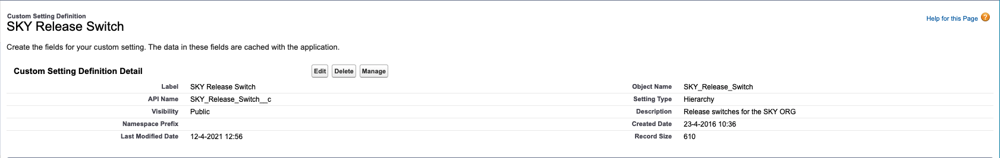

# Release strategies(release switches)

---

A release switch is required to be deployed together with a new feature in order to either activate it at a later date or prevent any potential risks that may come with the feature.
In case of the latter, a simple toggle of the switch will revert back to the old functionality until the potential issue is fixed.

Release switches can be found in the custom setting named `SKY_Release_Switch__c`.

From this custom setting, you can add a new checkbox field, defaulted to unchecked. Then, you can use it in your code base as such:

    if(SKY.getSkyReleaseSwitch().Test_Release_Switch_Enabled__c) {
        // New feature logic inserted here
    }

Note that `SKY.getSkyReleaseSwitch()` is a static method that can be accessed globally and queries the SKY_Release_Switch__c custom setting.

Another step in the deployment of the release switch is to create an post anonymous apex script which enables by default the release switch in sandbox environments.

    SKY_Release_Switch__c relSwitch = SKY_Release_Switch__c.getOrgDefaults();
    if (relSwitch != null) {
        relSwitch.Test_Release_Switch_Enabled__c = DBO_OrgUtil.isSandbox();
        update relSwitch;
    }

More information on anonymous apex scripts can be found [here](/wiki/deployment/anonapex.md)

---

[Home](/wiki/Home.md) - [Deployment](/wiki/deployment/deployment.md) - Release strategies(release switches)