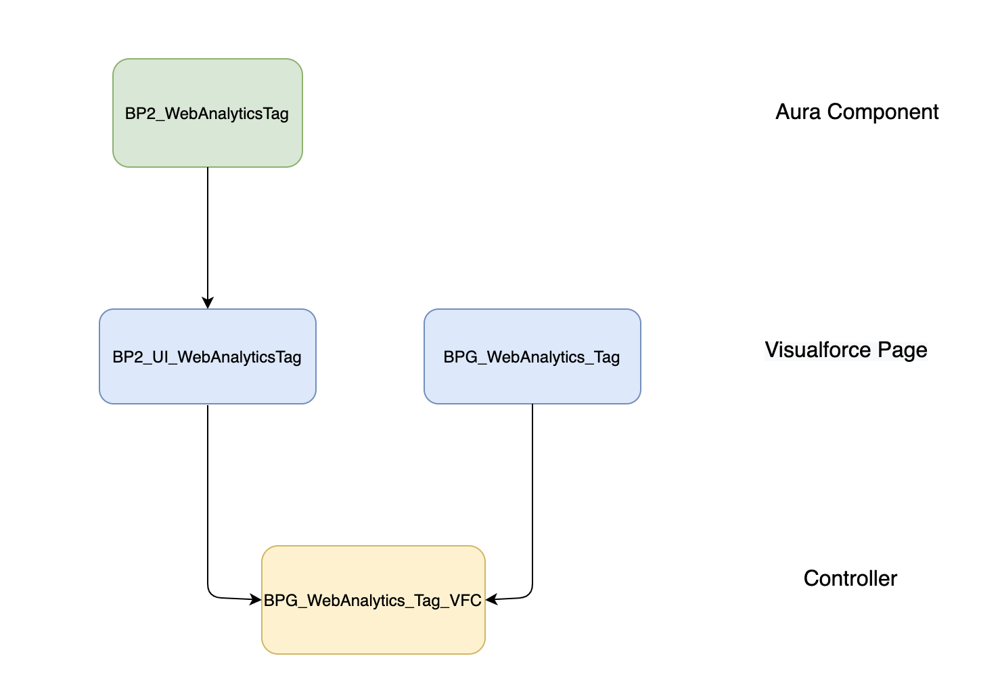
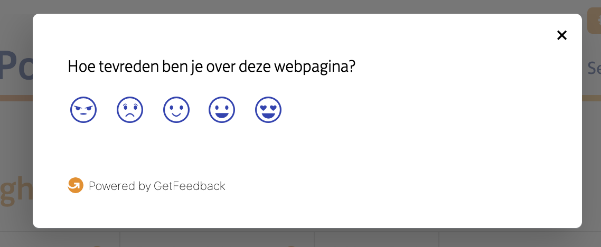

# Feedback & Analytics for Communities - Usabilla & Adobe via Tealium/Apsis

---

# Adobe Analytics
**Adobe Analytics** is the industry-leading solution in terms of being able to keep track of what happens on your 
website. It helps understand user behavior, adoption, and utilization of functionality.

## Apsis and Tealium

|                               |APSIS                                 |Tealium                              |
|-------------------------------|--------------------------------------|-------------------------------------|
|About                          | old connected app used for analytics | new connected app used for analytics|                             |
|Where is the data being stored | Info object                          | Intel object                              |

### Migrating data from Apsis to Tealium

  In order to migrate data from the old data layer to the new one, a set of collectors has been developed.
Their main purpose is to map the data stored in Info into Intel and to make sure that the format is according to the one
required in the DataLayer Package built by the Online Intelligence team:
https://github.com/OnlineIntelligence/Datalayer_package

After the data is correctly configured, the connection to the data layer is established and the data collection process begins.

## Adobe Analytics in Mijn PostNL

Because the Business Portal contains both **Visualforce** and **Aura** pages, in order to collect analytics data, a 
system as shown in the diagram below had to be developed.

For Visualforce pages, the **BPG_WebAnalytics_Tag** component is used to collect data into the Info object and send it 
further to Intel using collectors.

Aura pages use the **BP2_WebAnalyticsTag** component to store the data in Info. This component uses the 
BP2_UI_WebAnalyticsTag page in order to connect to the controller that is commonly used by both types of pages.

## Adobe Analytics in Mijn PostNL Zakelijk

For the Mijn PostNL Zakelijk portal, the data is collected following this process:
  1. the ***pnlWebAnalytics/lib/configuration.js*** file is used in order to define functions that collect data
  2. the ***pnlWebAnalytics/lib/useranalytics.js*** file loads the user information from the server or session storage
  3. the ***pnlWebAnalytics/lib/analytics.js*** file populates the Info object and sends data to adobe analytics
  4. the ***pnlWebAnalytics/pnlWebAnalytics.js*** file controls the flow of loading analytics

### Where can you find analytics?
- Visualforce
  - src/components/BPG_WebAnalytics_Tag.component
- Aura
  - src/aura/BP2_WebAnalyticsTag
- LWC
    - src/lwc/pnlWebAnalytics
- Static resources
    - build/pnl_analytics/PNL_Analytics_Assets.resource
    - src/staticresources/PNL_Webanalytics.resource

# Usabilla
**Usabilla** is a self-service, cloud-based enterprise software-as-a-service platform used for capturing real-time 
visual user feedback.

### Where can you find usabilla?
  - src/aura/BP2_Usabilla/BP2_Usabilla.cmp
  - src/staticresources/Usabilla.resource

---

[Home](/wiki/Home.md) - [External resources](/wiki/external_resources/external_resources.md) - Feedback & Analytics for Communities - Usabilla & Adobe via Tealium/Apsis