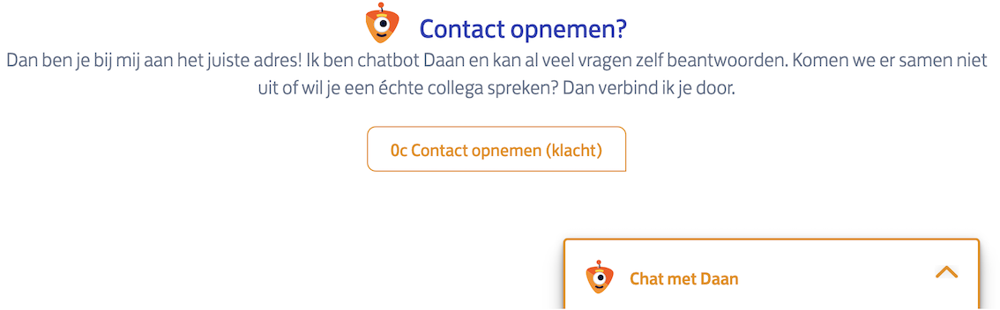
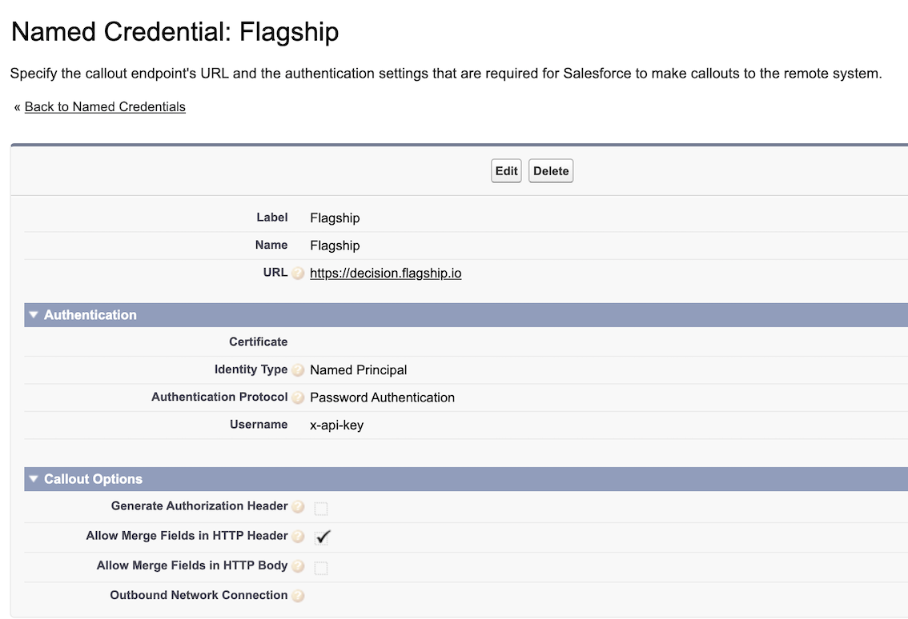

# PostNL Chatbot

---

The PostNL Chatbot Noor is standard web component created by the Chatbot team. This feature is used in the PostNL project in the **Business Track&Trace** module.

## How to Chatbot Noor works

The Chatbot contains two components: the **trigger** and the **chat window**.</br>
The **trigger** is the entrance to the chatbot. This trigger will contain a button to start the chat. When the button is selected a chat window will open.</br>



The **chat window** is the place where users can write and read messages to the chatbot. This windows will be hidden initially. It will be opened when the user starts the chat by clicking one of the buttons in the trigger.

 

## Implementation

###  1. Add the script

To import all the JavaScript needed to run the Chatbot on the page, add the next script to your HTML. The position of the script in your HTML does not matter.</br>
In the following example, jouw.pat.postnl.nl is the acceptance environment:

    ```
     <script src="https://jouw.pat.postnl.nl/services/widgets/webcomponents /postnl-widgets/postnl-widgets.esm.js"></script>
    ```
**Important:** For the Production environment, the production URL needs to be configured.

### 2. Insert the chatbot trigger

The trigger component `pnl-chatbot-trigger` for the Chatbot Noor is implemented in the `TT_Detail_Data.component` file. The location of the component does matter because it will define the location of the chatbot-trigger on your page.

    ```
    <!-- External component for Noor -->
        <pnl-chatbot-trigger base-url ="{!$Setup.Business_Portal_Defaults__c.URL_Noor_chat_bot__c}/services/swp/middleman"
                             business-customer-id = "{!ttinstance.businessCustomerId}"
                             country-code = "{!detailShipment.recipient.Land.code}"
                             postal-code = "{!detailShipment.recipient.PostCd}"
                             barcode = "{!detailShipment.barcode}"
                             business-module-name = "Track&Trace"
                             business-portal-name = "Mijn PostNL"
                             customer-first-name = "{!$User.FirstName}"
                             customer-last-name = "{!$User.LastName}"
                             business-phone-number = "{!ttinstance.businessPhoneNumber}"
                             business-user-id = "{!$User.ContactId}"
                             customer-email = "{!$User.Email}">
        </pnl-chatbot-trigger>
    ```
The base-url parameter is required for the Chatbot to know where to find all the configurations. The other parameters configured are optional.

**Important:**  For the Production environment you need to configure the production URL as base-url.

### 3. PostNL Web Fonts

To add the correct fonts and icons on your page, verify that the following link is to the head of the page:

    ```
    <link rel="stylesheet" type="text/css" href="https://jouw.pat.postnl.nl /services/widgets/styles/postnl-fonts.css">
    ```

## How is the Chatbot available in the Business Track&Trace module

The conditions for the Chatbot to be available for the customers using the Track&Trace module are:
- the shipment for which they want details to be Pre-Alerted, indicated by the `preAlerted` attribute defined in the `TT_Detail_Data.component` file is true;
- the `showChatBotFlagship` attribute defined in the `TT_Detail_Data.component` file is true;
- the `Noor_bot_in_T_T__c` checkbox from the `SKY_Release_Switch__c` object is true.

Only if all conditions are met Chatbot is active.

The `preAlerted` attribute:

    ```
        <apex:attribute name="preAlerted" type="Boolean" default="false" description="Indicates if it's coming from Pre-Alerted Shipments"/>
    ```
The `showChatBotFlagship` attribute:

    ```
        <apex:attribute name="showChatBotFlagship" type="Boolean" description="Holds the result from ABFlagship for chatbot display"/>
    ```
The value of the `showChatBotFlagship` attribute is set in the `TT_Sent_Shipments_Detail.page` through the `showChatBot` boolean variable. This variable is declared in the `PSM_Search_Shipment_Handler` and set in the `setShowChatbot`, a method used for retrieving the FlagShip Variation.
For more details about this process check the documentation about Flagship.

## How to connect to the Chatbot Noor
The requirements for connecting to the Chatbot are:
- whitelist the community URLs for the development/test/etc. environments for the chatbot;
- in the Named Credentials, in the *Flagship* record, verify that the fields are completed according to the image below and that the password is the right one;

{:height="700px" width="400px"}

- in Custom Settings, in the *BP Flagship Campaigns*, on the *TrackTrace* record, set the correct value for the Campaign Id field;
- in Custom Settings, in the *Webservice Endpoints*, on the *BP_Flagship* record, set the correct value for the Endpoint field;
- in Custom Settings, in the *SKY Release Switch*, verify that the *Noor bot in T&T* checkbox is selected.

---

[Home](/wiki/Home.md) - [External resources](/wiki/external_resources/external_resources.md) - PostNL Chatbot
