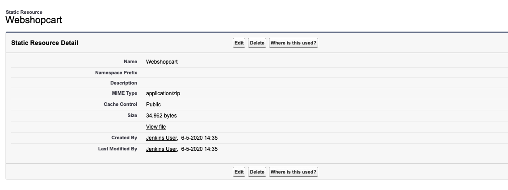

# PostNL Shopping Cart

---

The PostNL shopping cart is a component used in the project, present in Visualforce pages and aura components.
Its implementation can be found in the static resources of the environment named `Webshopcart`.



The resource contains 3 files:
```
.
├── index.html
├── polyfills.js
├── runtime.js
```

In Visualforce, the shopping cart is included in `BPG_Base_Template.page`, which is extended by all main pages of the Business Portal.
Inside the main container of the template, it is used as follows:
```
<div id="webshop-cart"><shop-mini-cart cart-id="current" language="{!IF($User.Language__c == 'en_US', 'en', 'nl')}"/></div>
```
The two js files are contained in the `BPG_Site_Wide_Scripts.component` (included in the header section) and this component is included in the template:
```
<c:BPG_Site_Wide_Scripts location="header" />
```

In Aura components, the shopping cart is included in `BP2_UI_UserControls.cmp`, which in the end is used in `BP2_UI_AppGeneric.app`.
Tis app is extended by all other Aura applications accross Business Portal. 

The shopping cart is contained in the following Iframe:
```
<iframe id="webshop-cart" sandbox="allow-same-origin allow-scripts allow-popups" src="{!$Resource.Webshopcart + '/index.html'}" frameborder="0" width="35px" height="42px" scrolling="no"/>
```


---

[Home](/wiki/Home.md) - [External resources](/wiki/external_resources/external_resources.md) - PostNL Shopping Cart
