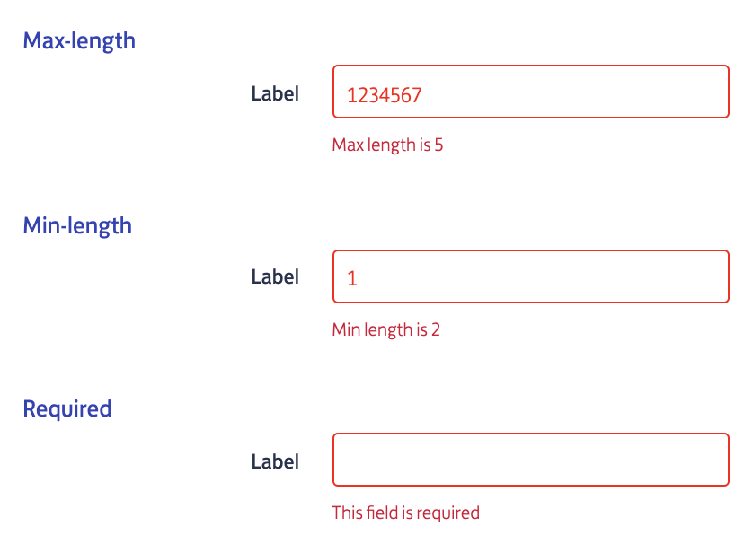

# Aura Base Components

---

### What is a base component?
A Base component is a Lightning Aura Component that is used across PostNL project to maintain the performance 
as well as the look and feel consistency.
Base component provides different flavours of UI for the same component.

#### Example
A good example of the flexibility that is provided by the Aura base components is given by the Input-text 
component (`BP2_UI_InputText`) that can enforce different validations on the input provided

#### Usage
The base component are used across the entire portal where the Aura technology is in place examples can be found in 
the following modules BulkMail / POBox / Reply numbers and the list can continue.

### Where can you find the Base Components?
We have one on the community(Community name: Mijn Postnl) where you can find the 
base components. - `c/BP2_Example_App.app`

### What are the different types of Base components?
You can access the page mentioned above in communities to know more about different base components.

### Where to find the code for all the base components?
Base components used in community page: - `BP2_Example_App`

Base components in aura folder with the name `BP2_UI*`

---

[Home](/wiki/Home.md) - [Frontend](/wiki/frontend/frontend.md) - Aura Base Components
