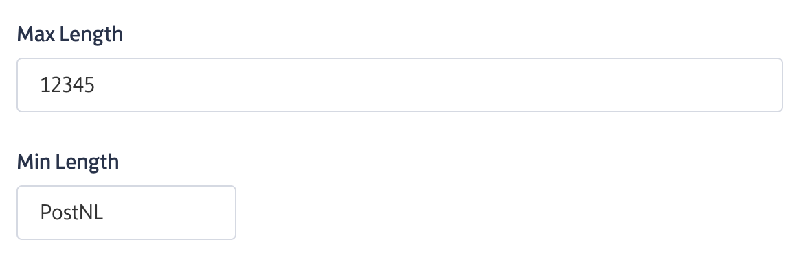
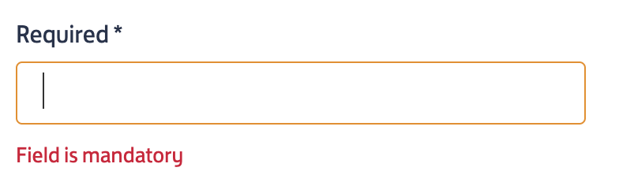
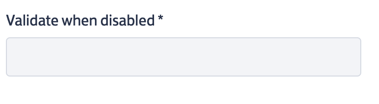
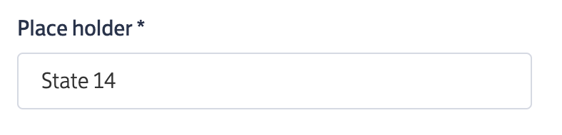

# LWC Base Components

---

### What is a Base Component?
A Base component is a Lightning Web Component (LWC) that is used across PostNL project to maintain the performance as well as the look and feel consistency.
Base component provides different flavours of UI for the same component.
For example:
- Input field:

	- You can have different sizes of input field

	

	- You can optionally make the field required, disabled by using the public attributes on the input field base component.

	
	

	- You can have place holder if needed

	

### Where can you find the Base Components?
We have created two pages on the community(Community name: Mijn Postnl Zakelijk) where you can find the base components.
- Page 1: *community URL +* /mpnl/s/uicomponents#/
- Page 2: *community URL +* /mpnl/s/functions#/

NOTE: inside "Form Data" base component you can find different types of fields and their flavours and also the way to use them.

### What are the different types of Base components?
You can access the page mentioned above in communities to know more about different base components.

### Where to find the code for all the base components?

Base components used in community pages:
- PnlTestAppFunctions
- PnlTestAppUiComponents

Base components in lwc folder with the name pnlUi*

---

[Home](/wiki/Home.md) - [Frontend](/wiki/frontend/frontend.md) - LWC Base Components
