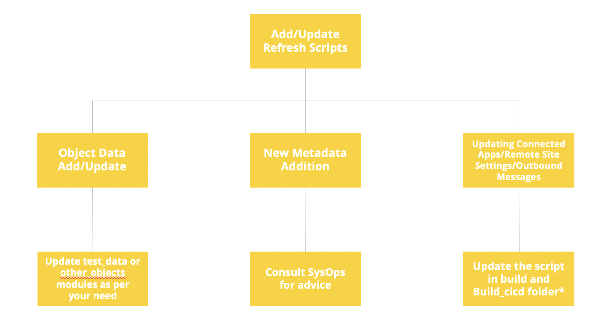

# Refresh modules

---

# Content
1. Sandbox Refresh Planning
2. Sandbox Refresh Scripts
3. Process for new Refresh Scripts

## Sandbox Refresh Planning
* SysOps recommends refreshing the environments every month, preferably after a major sprint release. Not refreshing the Sandboxes renders the environments inconsistent, especially the Sandboxes used for Development. (e.g. SRVCDEV, DEV etc.) 

* During a Salesforce release(Spring, Summer, Winter), Sandbox and Production are on different Salesforce release versions, hence it is recommended that the Sandboxes are not refreshed at that time. ONLY Sandboxes which are Non-Preview instances can be refreshed without any problems.  Refreshing a preview instance downgrades the environment. 

Activity                       | Responsible
-------------------------------| -------------
Recommending Refreshes         | SysOps Team
Updating Agenda for Refreshes  | Agile Team Leads

## Sandbox Refresh Scripts

* The refresh scripts can be located under build/refresh_tool. This folder contains the main build.xml and build.properties file.

* Different modules in the refresh can be located under build/refresh_tool/modules

* At the time of writing the document, we have the following refresh scripts modules:

1. Business Portal Defaults
2. Connected Apps 
3. Remote Site Settings
4. Webservice Endpoints
5. Named Credentials
6. Outbound Messages
7. Content Assets and Documents
8. Products 
9. Test Data, Extra Test Data and Other Objects
10. Email Scrambler
11. Destructive Changes

### Refresh Script for Business Portal Defaults

#### **Build.xml**
The file consists of script that extracts the data for business portal defaults from the target org (org being refreshed) and then deletes it.

The file then extracts the data from source org (UAT) and loads the business portal data in the target org (org being refreshed) based on the SOQL queries specified in the build.properties file.

#### **Build.properties**
The build.properties file of this module contains the query for business portal defaults. All relevant fields must be specified here else the data won’t be loaded.

The file also consists the directory configuration information for the mapping and can be accessed from the following destination [here](/build/refresh_tool/modules/business_portal_default/build.properties)
 

#### **Property files**
The mapping folder consists of the sdl files for the business portal defaults custom settings.

Sample mapping file can be found at the following destination [here](/build/refresh_tool/modules/business_portal_default/mapping).

***
###  Refresh Script for Connected Apps

#### **Build.xml**

This file contains the reference to the deployment script for connected apps which is stored [here](/deploy/modules/connected_app).

The script extracts the connected apps from the target org (org being refreshed) and then using the property files for connected apps stored [here](/deploy/modules/connected_app/orgs), the connected app metadata is scrambled at run time and then deployed to the environment being refreshed. 

#### **Build.properties**

The build.properties file of this module contains directory configurations, specifying the location of metadata, deploy scripts for connected apps.

#### **Property files**

The property files are located [here](/deploy/modules/connected_app/org) folder as they are also required for the deployment process apart from the refreshes. 

The property files are a mapping file that specify what values a particular parameter should have. 

Sample property file can be accessed from [here](/build/deploy/modules/connected_app/orgs/dev.properties).
***
### Refresh Script for Outbound Messages

#### **Build.xml**
This file contains the reference to the deployment script for outbound messages which is stored [here](/deploy/modules/outbound_message_endpoints).

The script extracts the workflows from the target org (org being refreshed) and then using the property files for outbound messages stored  [here](/deploy/modules/outbound_message_endpoints/orgs), the workflow metadata is scrambled at run time and then deployed to the environment being refreshed. 

#### **Build.properties**
The build.properties file of this module contains directory configurations, specifying the location of metadata, deploy scripts for outbound messages. 

#### **Property files**
The property files are located [here](/deploy/modules/outbound_message_endpoints/org)  as they are also required for the deployment process apart from the refreshes. 

The property files are a mapping file that specify what values a particular parameter should have. 

Sample property file can be accessed from [here](/build/deploy/modules/outbound_message_endpoints/orgs).
     
***
### Refresh Script for Remote Site Settings

#### **Build.xml**
This file contains the reference to the deployment script for remote site settings which is stored [here](/build/deploy/modules/remote_site_security).

The script extracts the remote site settings from the target org (org being refreshed) and then using the property files for remote site settings stored [here](/build/deploy/modules/remote_site_security/orgs), the remote site settings metadata is scrambled at run time and then deployed to the environment being refreshed. 

#### **Build.properties**
The build.properties file of this module contains directory configurations, specifying the location of metadata, deploy scripts for remote site settings.

#### **Property files**
The property files are located under [here](/build/deploy/modules/remote_site_security/org) as they are also required for the deployment process apart from the refreshes. 

The property files are a mapping file that specify what values a particular parameter should have. 

Sample property file can be accessed from [here](/build/deploy/modules/remote_site_security/orgs/).
    
***
### Refresh Script for Webservice Endpoints

#### **Build.xml**
The build.xml contains the ANT script that retrieves the webservice endpoints custom settings data from the target org (the org being refreshed) and then deletes it from the org.

The script then makes use of the csv files per org and the mapping sdl file to load the webservice endpoints custom settings data back to the org.

#### **Build.properties**
The data folder consists of csv files consisting of the webservice endpoints records per environment. There are csv files for dev, test, uat and production orgs. 

The teams are expected to keep these files up to date whenever they are working on any new webservice endpoints.

Sample data files can be accessed from [here](/build/refresh_tool/modules/webservice_endpoints/data).

#### **Property files**
The mappings folder consists of sdl files which maps the fields for the data load based on the csv files present in the data folder. 

Mapping file can be accessed from [here](/build/refresh_tool/modules/webservice_endpoints/mapping). 

***
### Refresh Script for Named Credentials

#### **Build.xml**
The script uses the name credentials metadata stored in the src folder uses the property files to map the right endpoints and certificates of the named credentials.

As a best practice we don’t store the passwords/api keys in source control and hence named credentials with password authentication are updated as a manual step. However the metadata of such named credentials can be committed with a dummy password.

#### **Build.properties**
The build.properties file of this module contains directory configurations and can be found [here](/build/deploy/modules/named_credentials/build.properties). 

#### **Property files**
The properties file of this module contains the org specific files which map the named credential with the right endpoint and the certificate. 

Sample property file for named credentials can be found [here](/build/deploy/modules/named_credentials/orgs).

#### **Source file**
The source file is nothing but the metadata for named credentials which currently sits in main src folder. 

***
### Refresh Script for Documents

#### **Build.xml**
The script retrieves the documents from the production org based on the package.xml specified in the package folder of this module.

After the documents are retrieved from production, they are loaded on the target org ( the org being refreshed)

#### **Build.properties**
The build.properties file of this module contains directory configurations, specifying the location of package.xml, temporary folders etc. It can be found [here](postnl-commercial/src/master/build/refresh_tool/modules/document/build.properties).

#### **Property files**
Since the documents don’t support the wildcard * character, the package.xml update becomes very important.

Only the documents specified in the package.xml of the module are loaded after the refresh.

You can specify the unwanted documents in the delete package.

The package.xml file can be accessed from [here](/build/refresh_tool/modules/document/package).

***
### Refresh Script for Content Assets

#### **Build.xml**
The script retrieves the content assets from the production org based on the package.xml specified in the package folder of this module.

After the content assets are retrieved from production, they are loaded on the target org ( the org being refreshed)

#### **Build.properties**
The build.properties file of this module contains directory configurations, specifying the location of package.xml, temporary folders etc. It can be checked at the following [link](/build/refresh_tool/modules/content_asset/build.properties).

#### **Property files**
Content assets support the wildcard.

The package.xml file can be found  [here](/build/refresh_tool/modules/content_asset/package/package.xml). 

***
### Refresh Script for Other Objects Module

#### **Build.xml**
The file consists of script that extracts the data for objects specified in the build.properties file.

Once the data is extracted based on the query present in the build.properties files, it is loaded into the target org (the environment being refreshed).

#### **Build.properties**
The build.properties file of this module contains the object names, specific queries depending upon what field data is required after the refresh.

The file also consists the directory configuration information for the mapping.

At the time of writing this document, the following objects are present in this module:

Countries__c

Zones__c

Zone &nbsp;_ Country&nbsp;_ Junction__c

ZoneGroup&nbsp;_ Zone&nbsp;_ Junction&nbsp;__ c

Authorization__c

Tile__c

Template__c

Template&nbsp;_ item__c

Navigation__c

Configuration&nbsp;_ Setting__c

Configuration&nbsp;_ value__c

Import&nbsp;_ Definition__c

Location__c

#### **Mapping**
The mapping folder consists of the sdl files for the objects specified in the build.properties.

The mappings can be accessed [here](/build/refresh_tool/modules/other_objects/mapping/). 

***
### Refresh Script for Test Data Module

#### **Build.xml**
This file consists of the ANT script which is used to load the data related to specific objects using anon apex and csv files. 

The following objects’ anon apex scripts are present in the script at the time of writing this and can be found at the following [here](/build/refresh_tool/modules/test_data/scripts/).

The following objects’ csv files are present in the script at the time of writing this:

Accounts & SKY Area.

#### **Build.properties**
The build.properties file of this module contains directory configurations, specifying the location of anon apex scripts, csv files etc.

#### **Scripts**
This folder consists of a list of anonymous apex scripts that are required to be run as a part of this module.

They can be accessed from [here](/build/refresh_tool/modules/test_data/scripts/). 

#### **Data and Mapping**

The data folder consists of the csv files for Account and SKY area objects.

The mapping folder consists of the respective mapping sdl files essential to load the data.

***
### Refresh Script for Extra Test Data Module

#### **Build.xml**
The file consists of script that executes anonymous apex code in the target org as part of the refresh process.

They can be accessed from [here](/build/refresh_tool/modules/extra_test_data/scripts/). 

#### **Build.properties**
The file contains the path to the scripts folder where all the anonymous apex scripts are located

They can be accessed from [here](/build/refresh_tool/modules/extra_test_data/scripts/). 

#### **Scripts**
The scripts folder consists of anonymous apex code, which will create new accounts, contacts and portal users (both single and hierarchy accounts and at least one user per account will have access to both business portal community and zakelijk portal community ) and also cases, addresses, party codes 

They can be accessed from [here](/build/refresh_tool/modules/extra_test_data/scripts/). 
***
### Refresh Script for Products

#### **Build.xml**
The file consists of script that extracts the data for Product object(s) specified in the build.properties file from the production org.

Once the data is extracted based on the query present in the build.properties files, it is loaded into the target org (the environment being refreshed).

Note : If the record is not present in production it won’t end up in the refreshed sandbox.

#### **Build.properties**
The build.properties file of this module contains the object names, specific queries depending upon what field data is required after the refresh.

The file also consists the directory configuration information for the mapping.

At the time of writing this document, the following objects are present in this [here](/build/refresh_tool/modules/products/build.properties).

#### **Mapping**
The mapping folder consists of the sdl files for the objects specified in the build.properties.

Sample mapping file can be found [here](/build/refresh_tool/modules/products/mapping/). 

***
### Refresh Script for Email Scrambler

#### **Build.xml**
This file consists of the ANT script which is used to scramble the email address using the script specified in the apex-code.txt file.

#### **Apex Code**
The apex-code.txt file consists of the anon apex script that scrambles the email data.
***
### Adding/updating new refresh scripts

##Process for Updating the Refresh Scripts

After you have decided the change that you want to make to the refresh scripts, follow the following approach for creating the pull requests.

Refresh script change                     | Which branch to create PR for?
-------------------------------| -------------
Change related to something that is already live in Production| Master.
Change related to a new feature not in Production yet  | develop_*. 
Change related to ANT scripts in geneeral | Master.
Named credentials property files change(This will change in the future)|Master.

---

[Home](/wiki/Home.md) - [Refresh tool](/wiki/refresh_tool/refresh_tool.md) - Refresh modules
